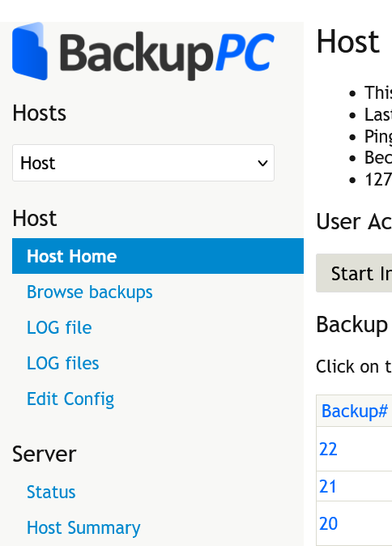

# BackupPC Custom CSS & Scripts

## Scripts

### How-to

Userscipts (`script.user.js`) can be used with any userscript manager browser extension, such as Violentmonkey or Tampermonkey.

You can also use the normal Javascript (`script.js`) and append the code to BackupPC's `sorttable.js` 

|Description|Preview|
|---|---|
|<h2>Hosts Selection to Top</h2>
JS/Userscript to move the navigation's hosts selection to the top. Thanks ChatGPT.
||

## Themes

### How-to

1. **Download Resources**  
   Place the custom CSS files in `/usr/share/backuppc/image/`

2. **Update Configuration**  
   Update `$Conf{CgiCSSFile}` with the CSS filename you want to apply:
   - **Via GUI**:  
     Navigate to *Edit Config* → *CGI* → *CgiCSSFile*
   - **Via File**:  
     Edit `/etc/backuppc/config.pl` and set the value of `$Conf{CgiCSSFile}`

|Description|Preview|
|---|---|
|<h2>90s</h2>
Retro theme with SNES/Famicom colors using [raphnet.net/design/console_colors](https://www.raphnet.net/design/console_colors/index_en.php) as reference.
||
|<h2>Modern</h2>
Heavily inspired by INSPINIA Bootstrap Theme.
<h3>Troubleshooting</h3>
If the host menu is out of place, change the <tt>margin-top</tt> values in:
<pre>br + div[class="NavMenu"] {} div[class="NavMenu"] + div[class="NavMenu"] {}</pre>||
|<h2>reset.css</h2>
Resets CSS and some BackupPC quirks to start building your own theme on.

Clear <tt>$Conf{CgiCSSFile}</tt> before you start and use a userstyle editor like Stylish.
||

## Troubleshooting

### Menu Icons Not Showing

If menu icons are not displaying correctly, consider these known issues:

#### 1. Incorrect GUI Subfolder Path

   If you're accessing the BackupPC GUI from a subfolder other than the default `/backuppc/`, the CSS file  references may be incorrect.

   **Fix**: Edit the CSS file and replace all occurrences of `/backuppc/index.cgi` with:  

- `/yoursubfolder/index.cgi` (adjust to your subfolder)
- `/index.cgi` (if accessing via a top-level domain)

#### 2. Restrictive Content-Security-Policy (CSP)

   A strict `Content-Security-Policy` header in your web server may block resources, resulting in errors visible in the browser's developer console.

   **Fix**: Ensure the `style-src` directive in your CSP header allows `use.fontawesome.com`.
